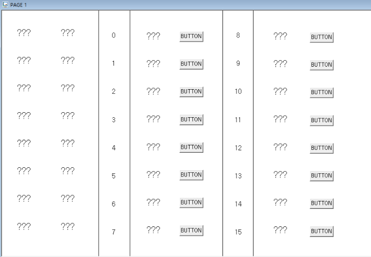

# 작업 내역
- PLC Y30~Y3F 스카다 이용해 제어 
- PLC X20~X2F 스카다에서 View 
- PLC-SCADA 통신은 Modbus TCP 통신 사용하였습니다. 

## Modbus Address Map
|  FC   |  Address  |   PLC   |       SCADA        |
| :---: | :-------: | :-----: | :----------------: |
|   3   | 1000~1015 | Y30~Y3F | 화면 우측 상태값 + Button |
|   3   | 1100~1115 | X20~X2F |     화면 좌측 상태값      |

> PDF에는 X32, Y64로 표시되어 있어서 X 및 Y Adress가 다를 수 있습니다.  
> Address가 다를 시 변경해야 합니다. 
## SCADA

## 현장 세팅 시 신경써야 할 부분 
### 네트워크 세팅 
- PLC
  - CICON -> 파라미터 -> PLC 파라미터 -> 이더넷 세팅
  - `PLC 네트워크 정보 입력` 
- SCADA
  - SCADA 구동 할 PC 네트워크 정보 수정 
  - CIMOND -> I/O 디바이스 
    - 통신포트 IP에 스카다 `PC IP` 입력 (127.0.0.1 입력시 통신 안됨)
    - 'PLC' 스테이션 설정 -> IP 설정 -> `PLC IP 입력`

### 작업시 사용한 세팅
> 공유기 이용한 네트워크 구축, PC-PLC 1:1 통신 둘 다 테스트 하였습니다. 
- PLC
  - 100.100.100.200
  - 255.255.255.0
  - 100.100.100.1
- SCADA
  - 100.100.100.201
  - 255.255.255.0
  - 100.100.100.1
- 네트워크 세팅은 현장에 맞게 변경할 수 있습니다. 

